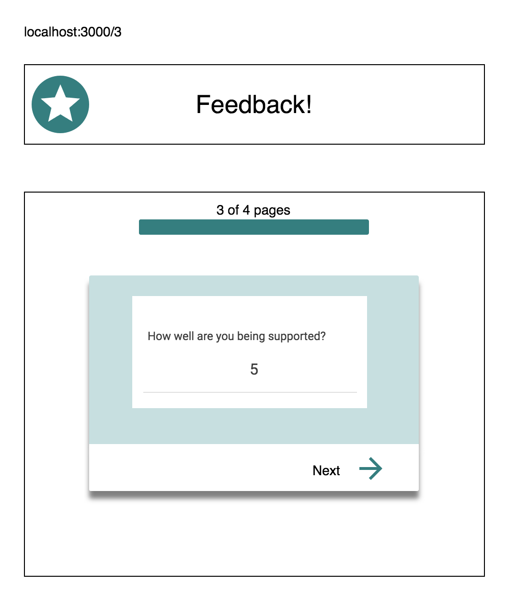
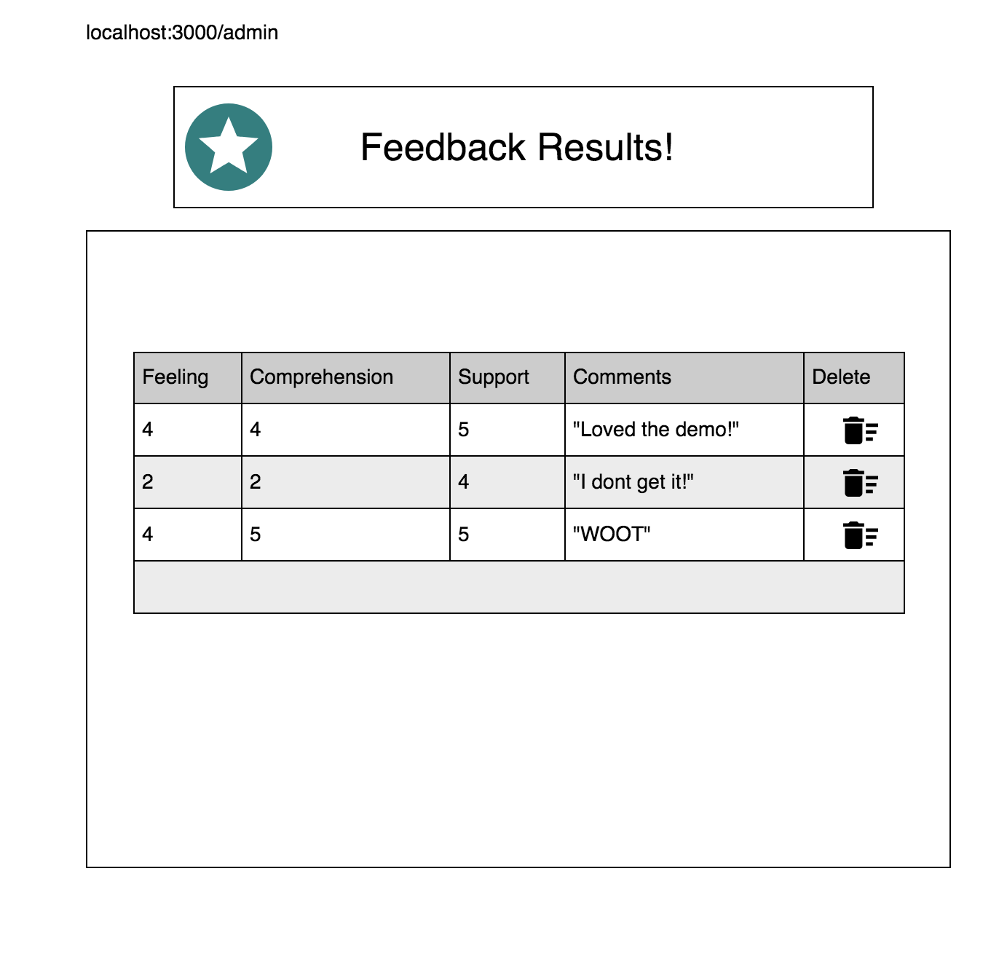

# Redux Feedback Loop

This project uses multiple page views with user inputs on each in order to build a set of user feedback data. Each page has one input. When the user moves to the next step their input is captured and appended to their previous inputs using Redux.

At upon submit at the final step this full set of user input data being stored in Redux is then posted to the database.

There is also an Admin page that retrives all the submitted data and displays it in list form. This page also allows an admin to delete from the database whichever set of feedback they want.

### SETUP

Create your database and tables using the provided `data.sql` file. Start the server.

```
npm install
npm run server
```

Now that the server is running, open a new terminal tab with `cmd + t` and start the react client app.

```
npm run client
```

### ADD NEW FEEDBACK

Create a multi-part form that allows users to leave feedback for today. 
There will be 4 views for the form parts.
The parts:
- How are you feeling today?

- How well are you understanding the content?

- How well are you being supported?

- Any comments you want to leave?


While there is no nav bar, each part of the form should be at its own route. Clicking next should move the user to the appropriate step in the process.

 When the form is complete, save the submission in the database. The user should see a submission success page.
 

### DISPLAY FEEDBACK

Display all of the existing feedback at the route `/admin`. The most recently added feedback should appear at the top of the list. Allow the user to delete existing feedback. Prompt the user to confirm prior to deleting the feedback from the database.



## STRETCH GOALS

- Update this README.md to describe the project in your own words
- Improve the styling of the app using Material-UI theme, cards, snackbars, buttons, nav bar, and icons, and anything else you'd like.
- Add the ability to flag an existing feedback entry for further review on the /admin view
- Deploy your project to Heroku -- you'll need to read the special instructions for building and deploying with these apps! 


> NOTE: These stretch goals are intended to be completed in order.