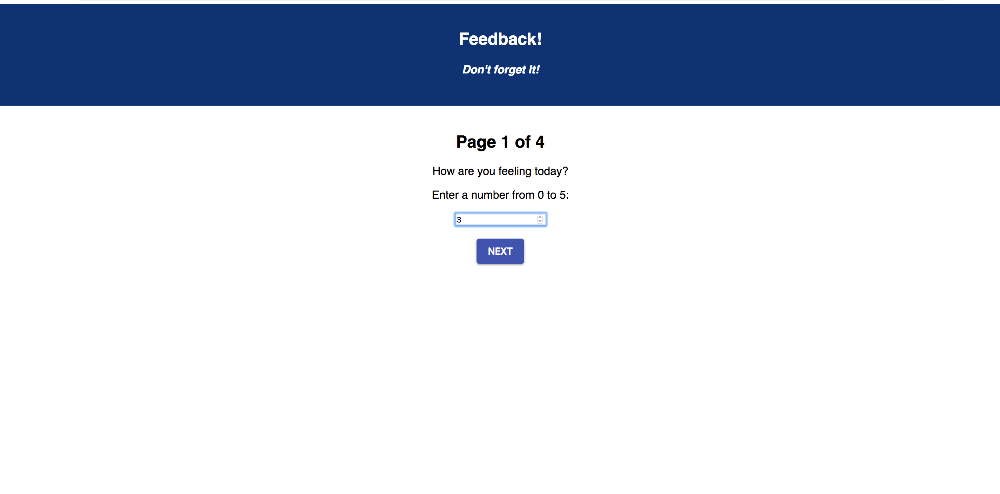
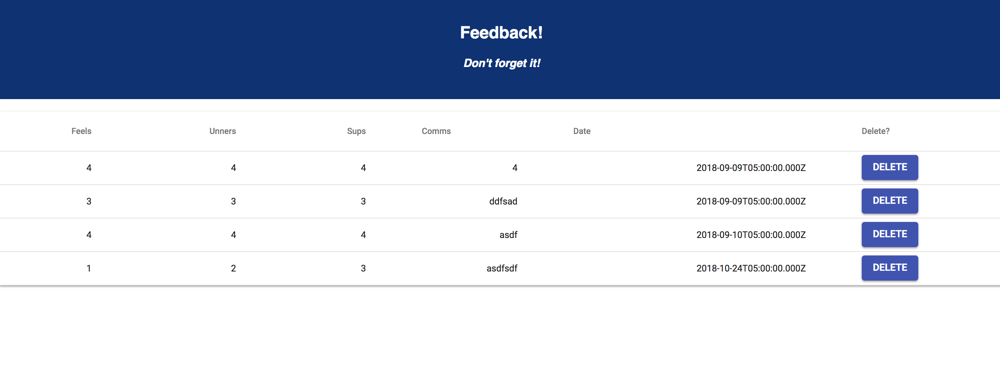

# Redux Feedback Loop

This project uses multiple page views with user inputs on each in order to build a set of user feedback data. Each page has one input. When the user moves to the next step their input is captured and appended to their previous inputs using Redux.

At upon submit at the final step this full set of user input data being stored in Redux is then posted to the database.

There is also an Admin page at `/admin` in the url that retrives all the submitted data and displays it in list form. This page also allows an admin to delete from the database whichever set of feedback they want.

### SETUP

Create your database and tables using the provided `data.sql` file. Start the server.

```
npm install
npm run server
```

Now that the server is running, open a new terminal tab with `cmd + t` and start the react client app.

```
npm run client
```
## Screen Shots

### Enter feedback pages: 




### Admin page:

